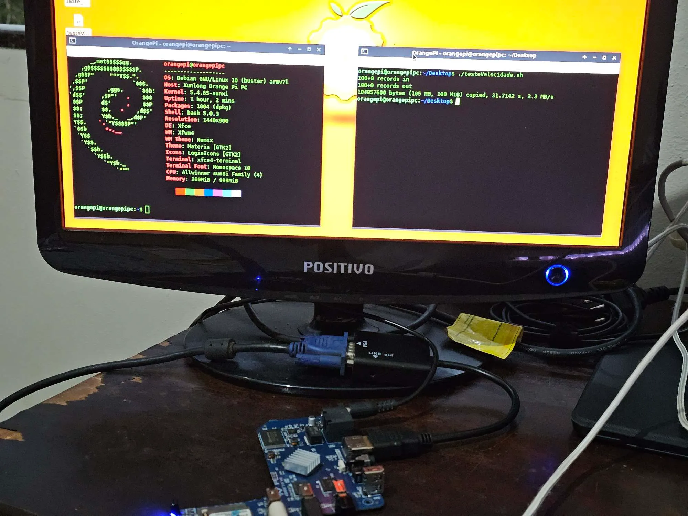
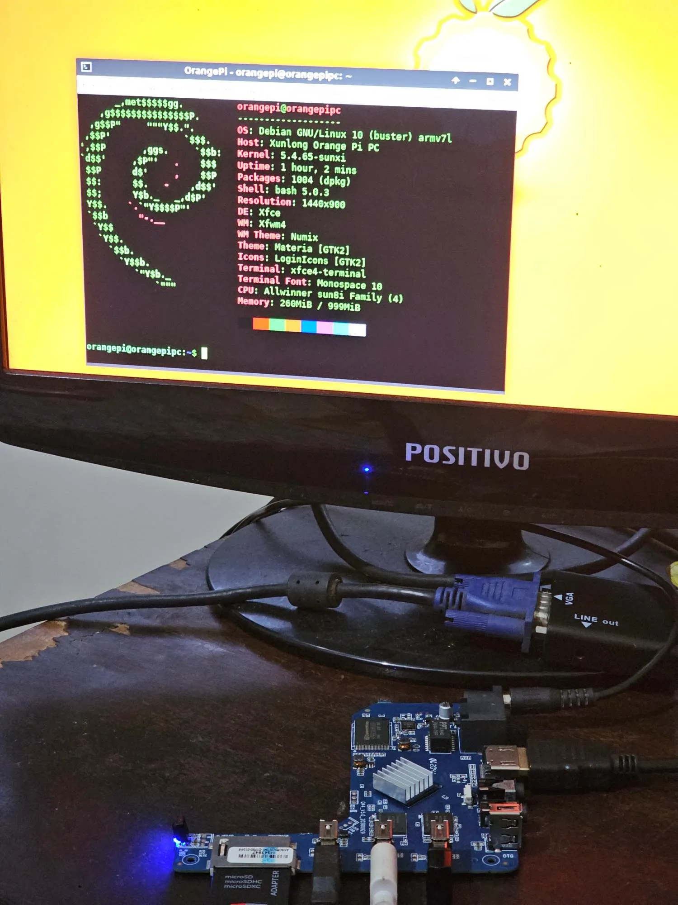
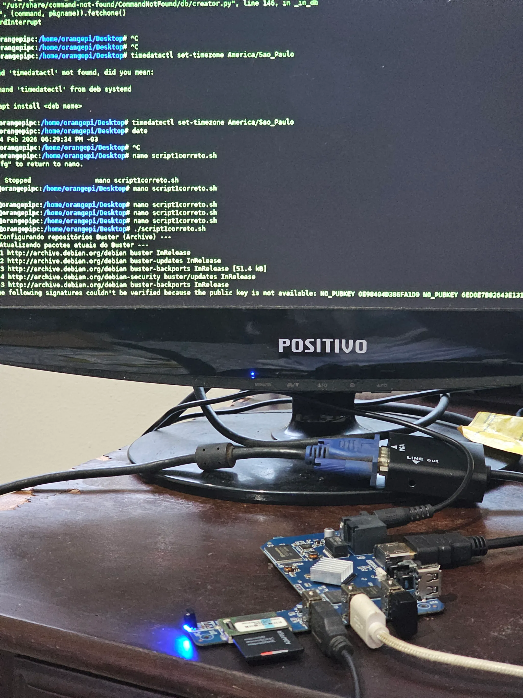
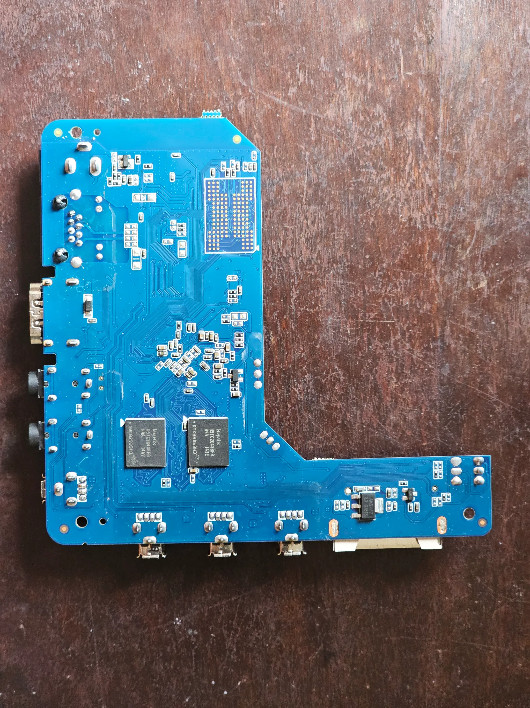
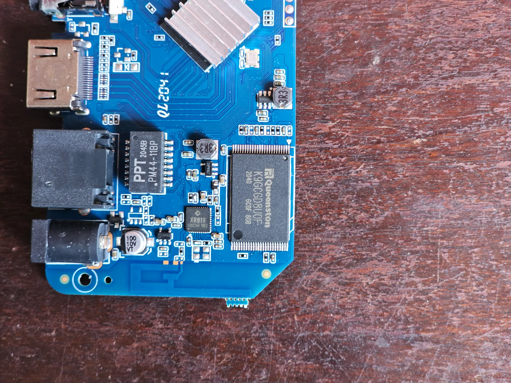
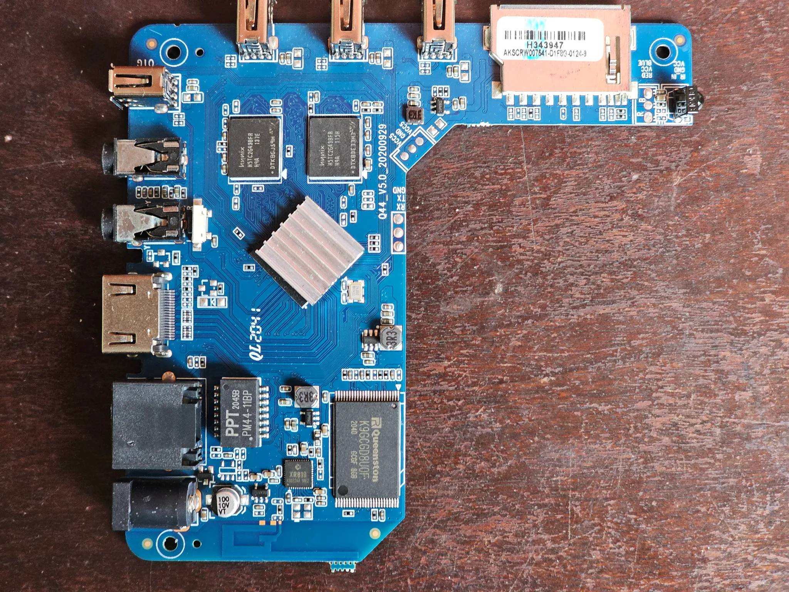

# TV Box with Linux (Allwinner H3)

🇧🇷 Leia em Português: [README-pt.md](README-pt.md)

------------------------------------------------------------------------

## About This Project

In this repository, I document the process I used to transform a generic
TV Box (Allwinner H3) into a fully functional Linux environment.

The system can run:

-   Terminal-only (server mode)
-   Desktop environment (GUI)

This project does not modify the internal NAND memory.\
If you remove the SD card, the TV Box returns to its original factory
Android system.

------------------------------------------------------------------------

## Hardware Used

-   CPU: 4× ARM Cortex-A7 @ 1008 MHz\
-   GPU: Mali-400 MP\
-   RAM: 1 GiB\
-   Internal Storage: 8 GB NAND

Chipset: Allwinner H3 (sun8iw7p1)

More technical information:\
https://linux-sunxi.org/H3

------------------------------------------------------------------------

## SD Card Speed Test

``` bash
cd yoursdcard/
dd if=/dev/zero of=teste_escrita bs=1M count=100 conv=fdatasync
```

Minimum recommended: **12MB/s**\
Ideal: **20MB/s real write speed**

------------------------------------------------------------------------

## Compatible ISOs

  | ISO | Kernel | Status |
|-----|--------|--------|
| https://www.retrorangepi.org/images/Sunvell-r69/ | X | Retro build |
| https://www.armbian.com/orange-pi-pc/ | 6.12.68 | Works (reduced performance) |
| Orangepipc_2.0.8_debian_buster_server_linux5.4.65.7z | 5.4.65 | Recommended |
| Orangepipc_2.0.8_debian_buster_desktop_linux5.4.65.7z | 5.4.65 | Recommended |
| OrangePi_pc_debian_stretch_server_linux3.4.113_v1.0.tar.gz | 3.4.113 | Legacy |
| OrangePi_pc_debian_stretch_desktop_linux3.4.113_v1.0.tar.gz | 3.4.113 | Legacy |


### Recommended Version

**Orangepipc_2.0.8_debian_buster (Kernel 5.4.65)**

------------------------------------------------------------------------

## Image Gallery

<table>
  <tr>
    <td></td>
    <td></td>
  </tr>
  <tr>
    <td></td>
    <td></td>
  </tr>
  <tr>
    <td></td>
    <td></td>
  </tr>
</table>

## Project Structure

    Estrutura
    ├── README.md
    ├── README-pt.md
    ├── scripts/
    │   ├── script1.sh
    │   └── script2.sh
    |── images/

------------------------------------------------------------------------

Based on the video:

https://www.youtube.com/watch?v=HaSdFQSUIho
